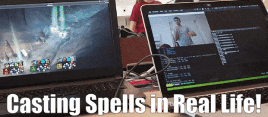

# Magicka 2 with Real Spellcasting!

So here's a crazy idea - what if you played computer games without controllers? What if you could cast spells by making arcane hand movements, just like a real wizard?

Here's us bringing that what if into reality (by the way, it turns out it's about as awesome as you'd think!).

## Equipment Needed
- Computers with Webcam (1 per controller)
- Linux-based computer for server and Xbox controller emulation
- Distinctly-colored items (to track your magic spells!)

## Description
This does the following:
- Emulate Xbox controllers on Linux
- Enable multiplayer through a socket server
- Use color-tracking with `opencv` in order to track your hand "casting" movements
- Map combinations in Magicka to handwritten digits (yes, we used an MNIST model :))

## Why
We built this for HackNRoll2019, but sadly we didn't get to demo it (the judges skipped our table because of an admin mix-up). Still, it's really cool.
